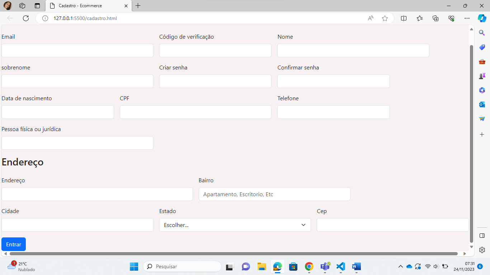

# 📋 Formulário de cadastro - Ecommerce 

### 📄 Primeiro site utilizado por mim foi a nike, é um site de diversos produtos, como roupas, sapatos etc. O segundo foi o site da Pandora, uma loja de joias como Braceletes, aneis, charms e outros. E o ultimo site foi o da umbro, o qual vende utensílios de futebol, como chuteiras, meiões, uniformes, dentre outros.

#### 👟 No primeiro site, foi feito o cadastro e diferente dos dois outros, ele deu a opção de pessoa física ou jurídica, e a escolha da preferência de itens. Pediram:
* E-mail
* Código de verificação
* Nome  
* Sobrenome
* criar senha
* Data de nascimento 
* Concordar com a política de privacidade e termos de uso 
* Pessoa física ou jurídica 
* CPF
* Data de nascimento 
* Telefone
* CEP
* Endereço
* Número 
* Complemento 
* Bairro
* Cidade 
* Estado 
* Produtos favoritos 
* Inscrever-se para receber atualizações do site 
* Concordar com a política de privacidade e termos de uso 

#### 💍 Ja no segundo site, também foi feito o cadastro, não teve nada de diferente, pediram:
* E-mail 
* senha
* código de verificção 
* criar senha
* confirmar senha
*  nome
* sobrenome
* data de nascimento 
* E-mail novamente
* concordar com os termos e condições 
* CPF
* telefone
* se quer receber emails com promoções e novidades 
* CEP
* endereço 
* número
* complemento e referência 
* bairro 
* cidade 
* estados
* destinatario
* forma de entrega
* escolha da forma de pagamento 

#### ⚽ E no último site, fiz o cadastro igual aos outros, e diferente dos dois anteriores, ele perguntou o gênero. Pediram: 
* E-mail
* Código de verificação 
* Criar senha 
* Confirmar senha 
* CEP
* E-mail 
* Nome 
* Sobrenome 
* CPF 
* Telefone 
* Gênero
* Data de nascimento 
* Quero receber e-mails com promoções 
* CEP 
* Rua
* Bairro
* Cidade
* Estado
* Forma de entrega 
* Número e complemento 
* Escolher forma de pagamento  

### 🛠️ Tecnologias
HTML

CSS

Git

### 🔧 Ferramentas
VSCODE
GitHub
Bootstrap

### Sites Utilizados
* MDN
* Nike
* Pandora
* Umbro

### Imagem do site 

### Autora 
[ Ana Laura](https://github.com/anacenali) 
